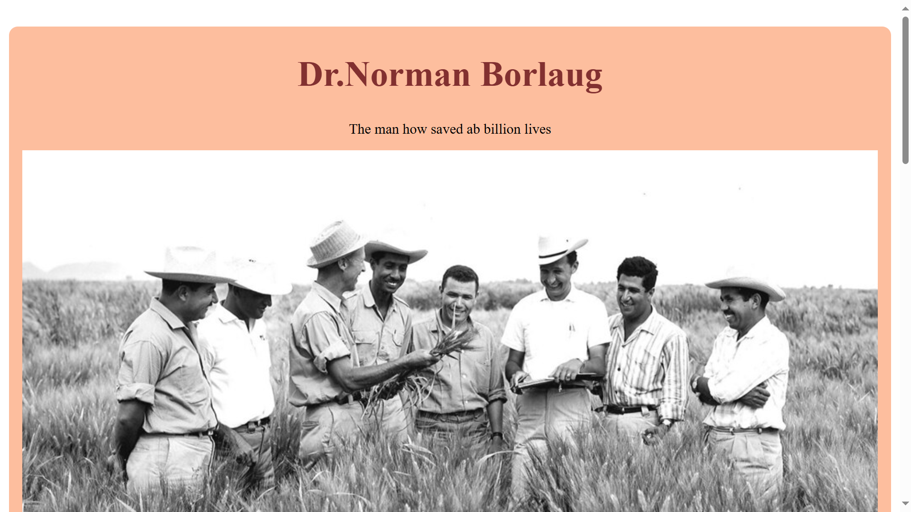

# Project Title 🚀
Documentation_page
## Project Description 📝

> this project is about a tribute page created using html and css codes

```html
<!--      <div class="listItem">
            <a id="tribute-info">information</a>
            <a href="" id="tribute-link" target="_blank">about this web_page</a>
 -->
```

```css
/* 
container h2 {
  text-align: center;
  padding: 30px;
  font-size: 40px;
}
 */
```


## Demo 📸


https://latifa-wakili.github.io/Tribute_page/

)
## Technologies Used 🛠️

## Technologies Used 🛠️

- HTML
- CSS


## Installation 💻

Provide step-by-step instructions on how to install and set up your project. Include any dependencies or prerequisites that need to be installed.

```bash
# git@github.com:latifa-wakili/Tribute_page.git.
```

```bash
# cd Tribute_page.
```

# vscode.
```

## Usage 🎯

```bash
# use git clone .
```

## Author 👩‍💻
- Twitter: [@Latifa_Wakili](https://x.com/WakiliLatifa?t=wlHTh8JuyFprQsN_hZQGWQ&s=08)
- LinkedIn: [Latifa Wakili](https://www.linkedin.com/in/latifa-wakili-68423b277?utm_source=share&utm_campaign=share_via&utm_content=profile&utm_medium=android_app)
- Email: [Latifa Wakili](saavenwakili@gmail.com)

## Contributing 🤝
for team working at first you should creat an organization on git hub nex you can creat pull_request on your project to shear whith your team and work on it together.

